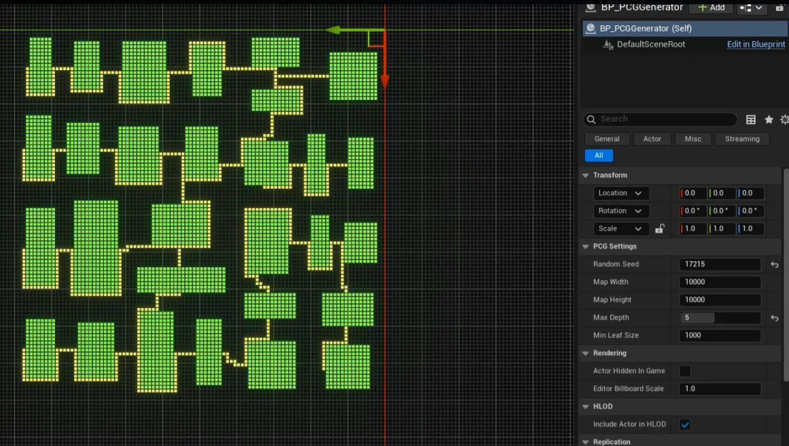

지난 4월, 언리얼 엔진으로 데이터 구조체를 이식하고 MST를 활용하여 방과 방을 잇는 논리적 그래프(선)를 시각화했다. 하지만 선은 캐릭터가 걸어 다닐 수 있는 물리적 공간이 아니다. 

이번에는 100m x 100m의 공간을 1m 크기의 타일들로 쪼개어 메모리에 올리고, A* 알고리즘을 통해 논리적 선을 실제 타일 복도로 변환하는 과정을 구현해보았다.

## 1. 논리적 선(Vector)에서 물리적 면(Grid)로

기존에 구한 데이터는 두 방의 중심점을 잇는 좌표로, 이를 실제 던전으로 렌더링하려면 타일 맵 데이터로 변환해야 한다.

가장 먼저 타일의 상태를 정의할 열거형을 만들었다.
- `Wall`: 파내지 않은 꽉 찬 벽
- `RoomFloor`: 방의 바닥
- `CorridorFloor`: 복도의 바닥

## 2. 1차원 배열을 활용한 2D Grid 메모리 최적화

2D 타일 맵을 구현할 때 흔히 `TArray<TArray<uint8>>` 형태의 2차원 배열을 떠올리기 쉽다. 하지만 이는 메모리가 연속적으로 할당되지 않아 CPU 캐시 지역성(Cache Locality)이 떨어져 병목의 원인이 된다. 

대신 1차원 배열을 2차원처럼 다루는 방식으로 메모리 파편화를 방지했다.

```cpp
// 2D 맵 데이터를 담을 1차원 배열 (캐시 최적화)
TArray<ETileType> GridMap;
int32 GridSizeX;
int32 GridSizeY;

// 2D(X,Y) -> 1D 인덱스로 변환하는 인라인 함수
// inline대신 FORCEINLINE 사용 (MSVC의 __forceinline 등으로 강제로 인라인화할 것을 명령)
FORCEINLINE int32 Get1DIndex(int32 X, int32 Y) const
{
    return Y * GridSizeX + X;
}
```

생성된 모든 Room 데이터의 영역을 1m 단위 타일 좌표로 변환하고, 이 1차원 `GridMap` 배열의 해당 인덱스들을 `ETileType::RoomFloor`로 덮어씌워 방을 파냈다.

## 3. A* 길찾기를 이용한 복도 생성

방을 모두 파낸 후, 4월에 구했던 MST `Corridors` 배열을 순회하며 A*로 탐색했다.

이때 매번 노드를 `new`로 할당하면 GC 부하와 메모리 릭이 발생할 수 있으므로, 언리얼의 `TUniquePtr`와 `TMap`을 컨테이너로 메모리 소유권을 관리했다. 또한, 성능이 중요한 닫힌 목록(`ClosedList`)은 2차원 맵 크기와 동일한 1차원 `TArray<bool>`로 할당하여 탐색시 O(1) 시간복잡도를 유도한다.

## 4. A* 가중치를 이용한 우회 경로 (Soft Constraint)

단순하게 A* 알고리즘 적용 시 최단 거리를 찾기 위해 복도가 방을 항상 뚫고 직진해버린다. 방의 모양이 훼손되지 않도록 탐색 중 바로 옆 타일이 `RoomFloor`일 경우 가중치(현재, +500점)를 부여하는 부드러운 제약(Soft Constraint) 방식을 적용했다.

```cpp
int32 MoveCost = 10; // 평지 이동 기본 비용

// [가중치] 방을 피해서 돌아가도록 가중치 부여
if (GridMap[NeighborIndex] == ETileType::RoomFloor)
{
    // 도착지가 남의 방 내부에 있는 경우가 아니라면 가중치
    if (!(NeighborX == TargetX && NeighborY == TargetY))
    {
        MoveCost += 500;
    }
}

int32 NewG = CurrentNode->G + MoveCost;
```

위 결과로 A* 알고리즘은 가중치를 받으면서 방을 뚫는 경우는 거의 없어지고, 대부분 방의 외각 벽을 따라 우회하는 경로를 찾게 된다.

## 5. 결과 시각화 및 다음 목표


> 위 이미지는 타일 렌더링 결과로, 초록색 타일은 방(Room)을, 노란색 타일은 방을 우회하며 이어진 복도(A* Corridor)를 나타낸다.

기존에 호출하던 `DrawDebugLine` 기반의 렌더링 함수를 지우고, `GridMap` 전체를 순회하며 바닥 타일에 `DrawDebugSolidBox`를 그리는 함수로 교체했다. 


다음은 `HISM(Hierarchical Instanced Static Mesh)` 컴포넌트를 활용해 위 사진과 같이 3D 스태틱 메쉬로 교체하고, Draw Call 최적화에 대해 알아보자.