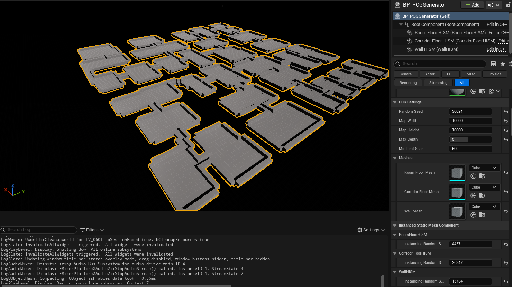

지난 5월, 2D Grid 배열을 활용하여 방+복도 데이터를 메모리에 올렸다. 하지만 지금까지 뷰포트에 띄운 `DrawDebugSolidBox`는 실제 게임에서 사용할 수 없는 에디터 전용 시각화 도구이다.

이번에는 이 n만 개의 데이터 배열을 바탕으로 실제 3D Static Mesh를 월드에 배치하되, Draw Call 문제를 방지하기 위해 `HISM` 컴포넌트와 은면 제거 알고리즘을 도입하여 렌더링을 최적화해 보았다.

## 1. Actor 스폰의 Draw Call 병목

100m x 100m 크기의 맵은 1m 단위 타일(여기서는 기본 제공되는 Cube) 10,000개로 이루어진다. 만약 이 타일마다 일반적인 `AStaticMeshActor`를 1만 개 스폰한다면 어떻게 될까?

CPU는 GPU에게 "1번 큐브 그려라", "2번 큐브 그려라" 하며 1만 번의 렌더링 명령(Draw Call)을 내리게 되고, 이는 CPU 병목 현상으로 이어지며 컴퓨터의 성능과 맵 크기에 따라 엔진이 튕길 수 있다.

## 2. HISM을 활용한 하드웨어 인스턴싱

이를 해결하기 위해 **HISM(Hierarchical Instanced Static Mesh)** 컴포넌트를 사용했다. HISM은 동일한 메쉬 1만 개를 그릴 때, 메쉬 원본 데이터 1개와 1만 개의 좌표(Transform) 배열만 GPU로 넘겨 **단 1회의 드로우콜**로 렌더링을 끝내는 최적화 기법이다. 

- `ISM`과 달리 계층적(Hierarchical) 구조를 가져, 시야 밖의 인스턴스를 통째로 Frustum Culling하거나 거리별 LOD 적용이 가능하다는 장점이 있어 거대 맵 생성에 유용하다.

## 3. 에디터 타임 메모리 관리 (`ClearInstances`)

PCG 툴은 에디터의 디테일 패널에서 Seed 값을 변경(`OnConstruction`)할 때마다 맵을 실시간으로 다시 생성한다. 이때 기존 메쉬 데이터를 지우지 않고 인스턴스를 계속 추가하면 에디터의 메모리가 쌓인다.

이를 방지하기 위해 렌더링 루프 시작 전, 이전 맵의 찌꺼기 데이터를 확실하게 비워주는 생명주기(Lifecycle) 관리를 적용했다.

```cpp
// 에디터 블루프린트에서 설정한 메쉬 할당 및 기존 인스턴스 초기화
RoomFloorHISM->SetStaticMesh(RoomFloorMesh);
RoomFloorHISM->ClearInstances();

// 복도 및 벽 HISM도 동일하게 ClearInstances() 호출...
```

## 4. 인접 타일 검사를 통한 은면 제거 (Culling)

1만 개의 타일 중, 플레이어가 걸어 다니는 방과 복도를 제외한 7~8천 개의 잉여 타일은 그냥 두툼한 벽으로 남는다. 이 벽 타일마다 모두 메쉬를 생성하면 보이지 않는 맵 외곽과 땅속 허공까지 수천 개의 큐브가 렌더링되는 메모리 낭비가 발생한다.

따라서 **"상하좌우 4방향 중 바닥이 단 하나라도 있는 벽(노출된 벽)만 렌더링한다"**는 은면 제거(Hidden Surface Removal) 로직을 추가했다.

```cpp
bool bShouldRenderWall = false;

// 4방향 탐색
for (int i = 0; i < 4; ++i)
{
    int32 nx = X + Dx[i];
    int32 ny = Y + Dy[i];
    
    if (IsValidGridPosition(nx, ny))
    {
        int32 nIndex = Get1DIndex(nx, ny);
        // 내 주변에 방이나 복도(바닥)가 있는가?
        if (GridMap[nIndex] != ETileType::Wall)
        {
            bShouldRenderWall = true; // 노출된 벽이므로 렌더링 승인
            break; 
        }
    }
}

// 렌더링 승인이 떨어진 벽만 Z축으로 올려서 HISM에 추가
if (bShouldRenderWall)
{
    FTransform WallTransform(FRotator::ZeroRotator, Position + FVector(0, 0, TileSize), FVector(1.0f));
    WallHISM->AddInstance(WallTransform);
}
```

## 5. 결과 시각화 및 다음 목표

> 위 이미지는 1M Cube 메쉬가 HISM으로 생성된 결과이다. 언리얼 콘솔로 `stat rhi` 확인 결과, 1만 개의 공간을 렌더링할때 DrawPrimitive Calls가 3회(방, 복도, 벽)만 실행되고 60프레임 이상을 안정적으로 유지한다. 지하에서 맵을 올려다보면 내부 벽면만 생성되고 맵 외곽의 불필요한 메쉬는 Culling 된 것을 확인할 수 있다.

이제 최적화된 3D 렌더링 뼈대가 완성되었다. 다음 달에는 벽변과 바닥에 비트마스킹, 푸아송 디스크 샘플링 등으로 프롭을 자연스럽게 배치해볼 것이다.

---
